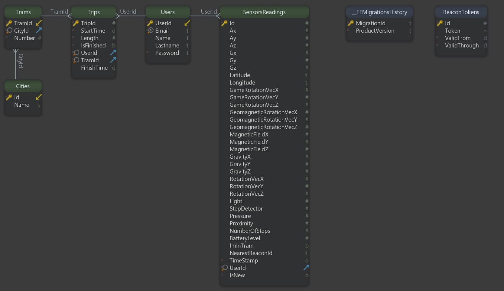
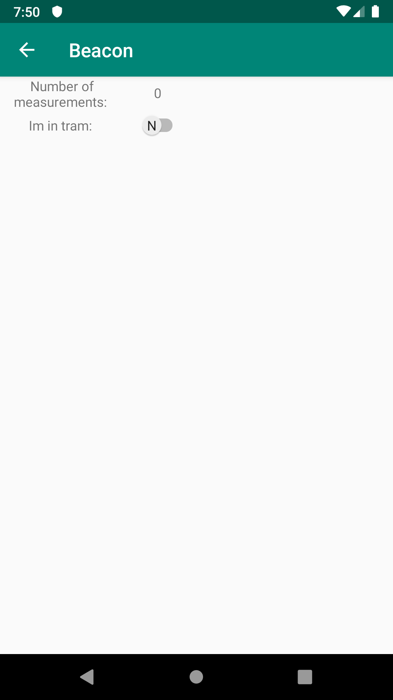

# Inteligentny tramwaj
## Spis treści
1. [Opis projektu](#1) 
1.1 [Ogólny schemat systemu](#1.1) 
1.2 [Szczegółowy schemat komponentów](#1.2)
2. [Skład zespołu](#2)
3. [Komponent 3. - Baza danych i serwer aplikacyjny](#3)
4. [Komponent 2. - Aplikacja mobilna](#4)
5. [Sieć neuronowa](#5)
6. [Komponent 1. - Urządzenie w tramwaju](#7)
## 1. Opis projektu
Celem projektu ***Inteligentny tramwaj*** jest stworzenie systemu informatycznego, który umożliwi naliczanie opłat za korzystanie z usług transportowych w sposób jak najbardziej intuicyjny i korzystny dla użytkowników komunikacji miejskiej. 
System będzie składał się z urządzeń beacon znajdujących się w pojazdach komunikacji miejskiej, aplikacji moblinej dla użytkowników końcowych oraz serwera aplikacyjnego. Ogólny diagram działania systemu znajduje się poniżej. 
 

## 1.1 Ogólny schemat systemu 

|</img>|
|:--:| 
| *Diagram przedstawiający działanie systemu* |

## 1.2 Szczegółowy schemat komponentów 
Poniżej został przedstawiony schemat komponentów tworzących system Inteligentny Tramwaj, który składa się z trzech głównych komponentów, które to w sposób szczegółowy zostały opisane w niniejszej dokumentacji.

|</img>|
|:--:| 
| *Szczegółowy diagram trzech komponentów tworzących inteligentny tramwaj* |

1. *Component 1 - Module in tram* - odpowiada za urządzenie znajdujące się w tramwaju, tj. Rasspberry Pi z modułem GPS potrzebnym do ustalenia lokalizacji pasażera korzystającego z systemu oraz podłączonego do urządzenia modułu Beacon, który w sposób ciągły wysyła do urządzeń klientów odpowiednie dane umożliwiające korzystanie z systemu inteligentnego tramwaju. 

2. *Component 2 - Mobile Application* - aplikacja mobilna zainstalowana na urządzeniach klientów, która umożliwia dzięku modułowi Bluetooth na komunikację z zainstalowanym w tramwaju Beacon'ie oraz ustaleniu odpowiednio czasu jazdy klienta oraz to czy klient znajduje się na pokładzie tramwaju.

3. *Component 3 - Application Server* - Aplikacja do której trafiają dane klientów poprzez aplikację mobilną - konieczne jest połączenie z internetem, żeby aplikacja mobilna mogła takie dany wysyłać na serwer. Serwer aplikacji zbiera dane oraz przechowuje je w bazie danych, dodatkowo serwer aplikacji jest zintegrowany z siecią neuronową, która odpowiada za ustalenie czy pasażer korzystający z systemu inteligentnego tramwaju znajduje się wewnątrz pojazdu.

Poszczególne komponenty zostały opisane w stosownych rozdziałach.

#### Funkcjonalności: ####
- Nadawanie danych dotyczących pojazdu i jego stanu przez urządzenie beacon
- Odbiór danych przez aplikację mobilną w telefonie
- Pozyskiwanie dodatkowych danych telemetrycznych z sensorów w telefonie
- Komunikacja aplikacji mobilnej z serwerem
- Określanie stanu użytkownika przez sieć neuronową, na podstawie dostarczonych danych i naliczanie opłat
- Obsługa kont użytkoników (rejestracja, autoryzacja, wybór sposobu płatności)
- Weryfikacja uprawnień przejazdowych przez kontrolera biletów
- Wysyłanie powiadomień wypychanych o rozpoczęciu i zakończeniu podróży (w zależności od preferencji użytkownika)
- Naliczanie opłat w przypadku utraty połączenia z telefonem
## 2. Skład zespołu
### Prowadzący: *mgr inż. Bartosz Wieczorek* 
### Baza danych i serwer aplikacyjny:
- Yaroslav Goretskyi
- Krzysztof Wierzbicki
- Przemysław Fortuna
- Jakub Przybylski
- Paweł Młynarczyk
- Dariusz Syncerek
- Konrad Kowalczyk
### Aplikacja mobilna:
- Paweł Ciupka
- Adam Lindner
- Michał Szwarocki
### Sieć neuronowa:
- Krzysztof Pilcicki
### Technologia beacon:
- Przemysław Brzoska
- Dorian Grabarczyk
### Dokumentacja:
- Jan Kisielewicz
- Mateusz Wadlewski   
## 3. Komponent 3 - Baza danych i serwer aplikacyjny
Aplikacja korzysta z bazy danych *PostgreSQL* znajdującej się w chmurze *Amazon Web Services*. Strukturę bazy prezentuje poniższy diagram.

 

||
|:--:| 
| *Diagram ERD przedstawiający strukturę bazy danych* |

Link do repozytorium: [https://github.com/PrzemekFortuna/iTram](https://github.com/PrzemekFortuna/iTram) 
Do komunikacji z aplikacją mobilną i przetwarzania pozyskanych danych utworzono serwer aplikacyjny w technologii *ASP.NET Core*.
API serwera znajduje się pod adresem: [http://itram.azurewebsites.net](http://itram.azurewebsites.net) 

#### Diagram klas UML
|</img>|
|:--:| 
| *Diagram powiązań klas wewnątrz aplikacji iTram* |

Poniżej szczegółowe diagramy klas niektórych klas:

|</img>|
|:--:| 
|Diagram klas odpowiadający za kierowanie zapytaniami w aplikacji.|

|</img>|
|:--:| 
|Diagram klas Content of Sensor odpowiadający za sensory zainstalowane w telefonie np. gyroskop, akcelerometr, rotację i lokalizację.|

|</img>|
|:--:| 
|Diagram klas Service odpowiadającej za serwisy w aplikacji.|
|1) Tram Service|
|2) Trip Service|
|3) City Service|
|4) Sensor Reading Service|

</img>|
|:--:| 
|Diagram klas odpowiedzialny za obszar DTO w dla całej aplikacji.|

|</img>|
|:--:| 
|Diagram klas encji aplikacji|

#### Dostępne endpointy:
Szczegółowy opis punktów dostępowych dostępny jest na stronie: [http://itram.azurewebsites.net](http://itram.azurewebsites.net)

#### Generowanie tokenów bezpieczeństwa
Tokeny generowane są raz dziennie oraz zapisywane w bazie danych. Na początku tej operacji z pliku konfiguracyjnego appsettings.json pobierane są następujące ustawienia:

    "BeaconToken": {
	    "TokenDurabilityInMinutes": 30,
	    "TokenLength": 8
    }
Oznaczają one kolejno czas ważności pojedynczego tokena w minutach oraz długość pojedynczego tokena wyrażoną jako ilość następujących po sobie liczb heksadecymalnych.
  
Za generowanie tokenów odpowiada klasa BeaconTokenService. Za każdym razem tworzona jest tablica bajtów o odpowiedniej wielkości, a następnie wypełniana losowymi liczbami heksadecymalnymi. Generator liczb losowych inicjalizowany jest ziarnem (ang. seed) powiązanym z aktualnym czasem w systemie co zwiększa poziom bezpieczeństwa.

TokenDurabilityInMinutes równe 30 oznacza że wygenerowane zostanie 48 tokenów, natomiast TokenLength równe 8 oznacza, iż tablica bajtów będzie miała rozmiar 4 elementów (do zapisania jednej liczby heksadecymalnej potrzeba czterech bitów).

Użycie pliku konfiguracyjnego pozwala zmienić omawiane parametry w każdym momencie bez rekompilacji kodu.

#### Uwierzytelnienie i autoryzacja
Za uwierzytelnienie użytkownika odpowiada klasa UserService. Jej metoda *Login* przyjmuje email oraz hasło użytkownika i w przypadku gdy w bazie danych istnieje użytkownik o podanych danych, tworzy nowy token [JWT](https://jwt.io) a następnie zwraca go użytkownikowi. Od tego momentu użytkownik jest traktowany jako uwierzytelniony i przy każdym żądaniu zobowiązany jest wysyłać otrzymany token w nagłówku HTTP co pozwala stwierdzić czy posiada on uprawnienia do wykonania danej akcji dostępnej w systemie.

#### Format odczytów danych sensorycznych
Odczyty sensoryczne które są wysyłane do aplikacji serwerowej w celu ich wykorzystania do nauczania sieci lub w celu określenia czy użytkownik znajduje się w tramwaju mogą być wyrażone w różnych jednostkach w zależności od używanego do ich pomiaru urządzenia. Użycie algorytmu [łańucha zobowiązań](http://zasoby.open.agh.edu.pl/~09sbfraczek/lancuch-zobowiazan,1,44.html) pozwala na dostosowanie różnych formatów, które mogą być otrzymywane od klienta do tych, które są używane w bazie danych oraz sieci neuronowej jeszcze przed wykonaniem tych operacji.

Poniżej zaprezentowano konwersję odczytów z żyroskopu:

    public class RadPerSHandler : GyroscopeHandler
    {
        public override object Handle(object request)
        {
            var unit = "rad/s";
            var req = request as DBConnection.Entities.Sensors.Gyroscope;
            if (req.GyroscopeUnit== unit)
            {
                return this;
            }
            else
            {
                return base.Handle(request);
            }
        }
    }
W bazie danych odczyty z żyroskopu przechowywane są w *radianach na sekundę (rad/s)* a więc jeśli odczyt jest wyrażony w tym formacie, to konwersja nie jest wymagana.

    public class RpmHandler : GyroscopeHandler
    {

        public override object Handle(object request)
        {
            var unit = "rpm";
            var req = request as DBConnection.Entities.Sensors.Gyroscope;
            if (req.GyroscopeUnit == unit)
            {
                var x = req.Gx * 2 * Math.PI / 60;
                var y = req.Gy * 2 * Math.PI / 60;
                var z = req.Gz * 2 * Math.PI / 60;
                req.SetGyroscope("rad/s", x, y, z);
                return this;
            }
            else
            {
                return base.Handle(request);
            }
        }
    }

W przypadku gdy odczyt wyrażony jest w *obrotach na minutę (rpm)* następuje konwersja do *rad/s*.

Dodanie nowych formatów ogranicza się do stworzenia nowej klasy dziedziczącej po klasie *GyroscopeHandler* oraz implementacji metody *Handle*.

#### Wykorzystanie sieci neuronowej
Nauczona sieć neuronowa pozwala określić czy użytkownik znajduje się w pojeździe komunikacji miejskiej. Aplikacja serwerowa przyjmuje kolekcję, która składa się z pewnej ilości odczytów z sensorów. Za jej obsługę odpowiada klasa *ModelsManager*. Polega ona na zmapowaniu otrzymanej kolekcji odczytów na inne kolekcje, które odpowiadają poszczególnym modelom znajdującym się po stronie sieci neuronowej. Wykonanie mapowania zapewnia, że do punktu dostępowego sieci neuronowej trafiają jedynie te atrybuty, które rzeczywiście będą użyte do wyznaczenia odpowiedzi, co skutkuje oszczędnością czasu i transferu.
Model sieci neuronowej generuje odpowiedź, która jest reprezentowana za pomocą klasy *NetworkReposnse*:

    public class NetworkResponse
    {
        public double Certainty { get; set; }
        public bool IsInTram { get; set; }
    }
gdzie *IsInTram* mówi czy użytkownik znajduje się w tramwaju, a *Certainty* oznacza stopień prawdziwości wyrażony jako liczba z zakresu [0, 1].

Oznacza to, że otrzymujemy kolekcję takich odpowiedzi o rozmiarze odpowiadającym liczbie modeli, które zostały użyte. Należy jeszcze wyznaczyć końcową odpowiedź, która zostanie odesłana do aplikacji mobilnej. Za operację tę docelowo odpowiada klasa *HighestCertainty*. Jej działanie polega na zwróceniu odpowiedzi, która charakteryzuje się najwyższym współczynnikiem prawdziwości.

Poniższy schemat prezentuje uproszczoną procedurę wyznaczania odpowiedzi:
|</img>|

Warty zaznaczenia jest fakt, iż dodanie kolejnego modelu ogranicza się do stworzenia klasy dziedziczącej po klasie *NeuralModel*. Wystarczy podać w jej konstruktorze adres URL punktu dostępowego z którego ma ona korzystać oraz typ który zawiera interesujące nas atrybuty:

    public class NeuralModelA : NeuralModel
    {
        public NeuralModelA(IMapper mapper) : base(mapper, typeof(ModelA), @"https://rocky-shore-34219.herokuapp.com/predict")
        {
        }
    }

    public class ModelA
    {
        public double? ax { get; set; }
        public double? ay { get; set; }
        public double? az { get; set; }
        public double? gx { get; set; }
        public double? gy { get; set; }
        public double? gz { get; set; }
    }

Równie łatwe jest dodanie nowego sposobu określania odpowiedzi końcowej, ogranicza się do implementacji interfejsu *IMetric*:

    public class HighestCertainty : IMetric
    {
        public bool Calculate(IEnumerable<NetworkResponse> replies)
        {
            return replies.OrderByDescending(x => x.certainty).First().isInTram;
        }
    }

## 4. Komponent 2. - Aplikacja mobilna
Link do repozytorium: <a href="https://github.com/PostAdam/TramBeaconApp">https://github.com/PostAdam/TramBeaconApp</a>  
Aplikacja mobilna ma na celu dostarczenie użytkownikowi interfejsu graficznego, za pomocą którego, możliwe będzie korzystanie z funkcji udostępnianych przez aplikację. Klient po zezwoleniu aplikacji na pobieranie i przetwarzanie dancyh z czujników znajdujących się w smartfonie, nie będzie musiał ingerować w celu rozpoczęcia i zakończenia przejazdu tramwajem. Aplikacja posiada prosty i intuicyjny interfejs, który umożliwia sprawne wykorzystywanie jej wszystkich funkcjonalności. 
Aplikacja została napisana w języku programowania *Java* z wykorzystaniem *Gradle*.    
Aplikacja zbiera następujące dane:
- nazwa użytkownika (String)
- aktualna data (Date)
- ID najbliższego beacona (String)
- przyśpieszenie (double)
- żyroskop (double)
- długość i szerokość geograficzna (double)
- poziom naładowania baterii (int)
- liczba kroków (float)
- siła grawitacji (double)
- poziom oświetlenia otoczenia (double)
- ciśnienie (double)
- otaczające pole geomagnetyczne (double)
- bliskość obiektu względem ekranu widoku urządzenia (double)
- flagę czy jest się w tramwaju (boolean)
   

|</img>|
|:--:| 
| *Diagram klasy odpowiedzialnej za dane z sensorów* |

#### Instrukcja użytkownika
| *Ekran* | *Nazwa ekranu* | *Opis* |
|:--:|:--:|:--:| 
|</img>| *1. Ekran rejestracji* | *W przypadku, jeśli użytkownik korzysta z aplikacji pierwszy raz, niezbędne jest by dokonał rejestracji.* |
|</img>| *2. Ekran logowania* | *Użytkownik, który posiada swoje konto, może zalogować się do aplikacji, by móc korzystać z reszty funkcjonalności* |
|</img>| *3. Ekran z listą dostępnych beaconów* | *Ekran pokazuję wszystkie dostępne beacony w najbliższym otoczeniu.* |
|</img>| *4. Ekran z informacjami o beaconie* | *Wybierając beacon z listy, użytkownik może sprawdzić bardziej dokładne informacje o nim.* |
|</img>| *5. Ekran pobierania danych telemetrycznych* | *Wybierając przycisk "SENSORS" na ekranie 3. użytkownik zaczyna pobierać dane telemetryczne, które z pewną częstotliwością zostają wysyłane na serwer.* |

#### Diagram klas UML
|</img>|
|:--:| 
| *Diagram klas aplikacji mobilnej* |

## 5. Sieć neuronowa
Link do repozytorium: <a href="https://github.com/kpilcicki/problem-workshop-net-poc">https://github.com/kpilcicki/problem-workshop-net-poc</a>  
Sieć neuronowa ma na celu, na podstawie danych otrzymanych od aplikacji mobilnej, określić czy dana osoba znjaduje się wewnątrz pojazdu komunikacji miejskiej. Docelowo aplikacja zostanie zintegrowana z serwerem. Aplikacja składa się z 3 modeli, na wejściu otrzymujemy wszystkie dane z sensorów, następnie filtrujemy je, aby sieć otrzymywała na wejściu tylko wybrane dane, w naszym przypadku to dane z akcelerometru i żyroskopu. Po przefiltrowaniu danych przechodzą przez trzy nauczone modele sieci, które na wyjściu dają odpowiedż w postaci prawdopodobieństwa, że użytkownik jest w poruszającym się tramwaju, i po otrzymaniu wyników wyliczamy średnią. 
Sieć została przygotowana w języku programowania *Python* z wykorzystaniem frameworku *TensorFlow*.

Modele sieci tworzyliśmy i trenowaliśmy następujacą metodą: Tworzyliśmy wiele wariantów architektury sieci neuronowej, następnie trenowaliśmy wszystkie używając aktualnych danych pobranych z sensorów urządzeń użytkowników aplikacji. Proces treningowy powtarzaliśmy wielokrotnie dla miarowo zmienianych pojedynczych hiperparametrów, a wyniki dla tak wytrenowanych sieci porównywaliśmy, np. poprzez sporządzenie odpowiednich wykresów pomocniczych (przykład - rys. 5.1). Najlepsze z modeli zostały zapisane wraz z ich parametrami do odpowiedniego formatu, by zostały wczytane na serwer odpowiadający za predykcję - odpowiadanie na pytanie, czy przy podanych wartościach odczytów sensorów użytkownik znajduje się w poruszającym się tramwaju, czy nie. Alternatywnym rozwiązaniem do statycznego wczytywania już wytrenowanych modeli byłoby tzw. ciągłe uczenie. Jednak takie rozwiązanie miałoby swoje minusy. Sam proces polegałby na wstępnym uczeniu danego modelu sieci, a następnie w trybie ciągłym co jakiś czas aplikacja pobierałaby nowe dane treningowe, w celu "douczenia" sieci. Pierwszy problem, który pojawia się przy takiej implementacji, to zjawisko przeuczenia sieci. Zbyt dużo danych treningowych moze spowodować, że model staje się zbyt wyczulony na konkretny podzbiór danych, przez co osiągałby gorsze wyniki dla ogólnych przypadków. Ten problem można by rozwiązać, sprawdzając miary jakości sieci przed i po każdym "douczeniu". Niestety prosty algorytm sprawdzania osiągów przed i po douczeniu przy pomocy jednego zestawu danych dawałby słabe bądź zadne efekty, więc należałoby sprawdzać sieć dla różnych kombinacji nowych danych i ich ilości, co nałożyłoby znaczne obciążenie na serwer. Jest to kolejny problem z tym rozwiązaniem - zaimplementowany sposób uczenia modeli na stałe sprawia, że aplikacja stawia znacznie niższe wymagania wobec maszyny, na której jest uruchomiona, i zużywa mniej jej zasobów. Tą zaletę wykorzystujemy, korzystając z darmowego hostingu o ograniczonej mocy obliczeniowej.

|</img>|
|:--:| 
| *5.1 Wykres przedstawiający testy do sieci neuronowej, trace 0: dokładność, trace 1: precyzja* |

|</img>|
|:--:| 
| *5.2 Model sieci neuronowej* |

## 6. Komponent 1. - Urządzenie w tramwaju 
Jest to główny komponent systemu Inteligenty Tramwaj znajdujący się wewnątrz pojazdów, który dzięki urządzeniu Raspberry Pi, modułowi GPS oraz systemowi *Bluetooth* jest w stanie dostaczyć do klientów dane potrzebne do celów daleszgo przetwarzania podróży.

## 6. Technologia beacon
W obecnej wersji systemu rolę beacon’u pełni minikomputer Raspberry Pi 3B+, który rozsyła sygnał Bluetooth Low Energy (BLE). Podstawowym sensorem, który wykorzystywany jest w systemie Inteligentny Tramwaj jest moduł GPS. Minikomputer jest w niego wyposażony przez nakładkę HAT firmy Adafruit. Raspberry działa na systemie operacyjnym Raspbian i uruchamia napisany w języku Python skrypt odpowiedzialny za przesył kluczy na początku oraz następnie za rozsyłanie sygnału w technologii BLE.
Paczka kluczy zawiera 8-znakowe klucze, które wykorzystywane są jako minor i major w sygnale BLE i służą do identyfikacji sygnału przez aplikację mobilną.
	Głównym zadaniem beacon’u jest identyfikacja tramwaju. Jeżeli aplikacja mobilna wykryje wcześniej wspomniany sygnał, będzie to oznaczało, iż użytkownik znajduje się wewnątrz tramwaju. Połączenie pomiędzy aplikacją mobilną a beacon’em przebiega w następujący sposób:
	
* Raspberry oczekuje na nawiązanie połączenia z aplikacją mobilną.
* Po pomyślnym połączeniu następuje przesłanie paczki z kluczami.
* Następnie co 30 minut zmieniany jest klucz, aż do momentu gdy zostaną wykorzystane wszystkie klucze.
    
Format sygnału nadawanego przez IBeacon

Sygnał wysyłany jest w szesnastkowym systemie liczbowym.
Pierwsza część sygnału jest w formacie  1e 02 01 1a 1a ff 4c 00, gdzie 4c 00 oznacza, iż jest to sygnał nadawany przez IBeacon.
Druga część sygnału to wiadomość, czyli współrzędne.

Przykład

Współrzędne: -171.234567, -179.234567

Wartości decymalne: 	  -  17 01  23 45   67  –  17 09  23  45  67

Wartości heksadecymalne:  FF 11 01 17  2D  43  FF 11 09 17  2D  43

Minus przy współrzędnych zamieniany jest na wartość FF, natomiast plus na 00. Występują one na 1 oraz 7 pozycji licząc od 1. 
Wartość przed kropka w współrzędnych jest zawsze w formacie 0x, gdzie x to pierwsza cyfra znajdująca się przed kropką (w przykładzie powyżej są to kolejno 01 oraz 09). Jeżeli na pozycji przed kropką znajdą się mniejsze liczby, wtedy wstawiamy 0.

|</img>|
|:--:| 
| *Przykładowy sygnał dla współrzędnych (-171.234567 , -179.234567).* |

</img>

