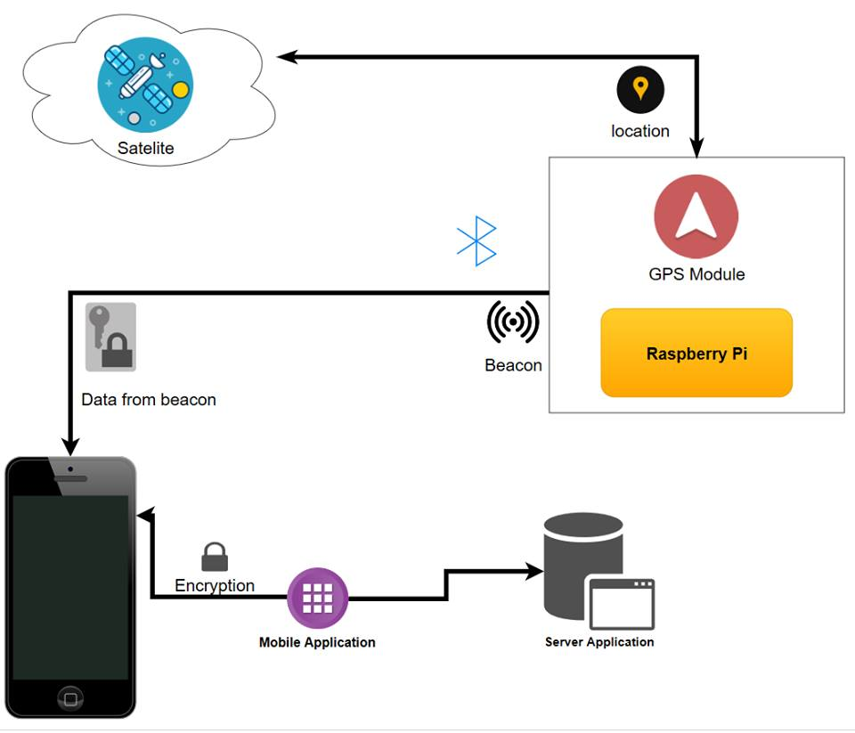

# Inteligentny tramwaj
## Spis treści
1. [Opis projektu](#1)

1.1 [Schemat komponentów](#1.1)

1.2 [Szczegółowy schemat komponentów](#1.2)

2. [Skład zespołu](#2)
3. [Komponent 3. - Baza danych i serwer aplikacyjny](#3)
4. [Komponent 2. - Aplikacja mobilna](#4)
5. [Sieć neuronowa](#5)
6. [Technologia beacon](#6)
7. [Komponent 1. - Urządzenie w tramwaju](#7)
## 1. Opis projektu<a name="1"></a>
Celem projektu ***Inteligentny tramwaj*** jest stworzenie systemu informatycznego, który umożliwi naliczanie opłat za korzystanie z usług transportowych w sposób jak najbardziej intuicyjny i korzystny dla użytkowników komunikacji miejskiej.<br/>
System będzie składał się z urządzeń beacon znajdującyh się w pojazdach komunikacji miejskiej, aplikacji moblinej dla użytkowników końcowych oraz serwera aplikacyjnego. Ogólny diagram działania systemu znajduje się poniżej. 
<br/>

## 1.1 Schemat komponentów <a name="1.1"></a>

|</img>|
|:--:| 
| *Diagram przedstawiający działanie systemu* |

## 1.2 Szczegółowy schemat komponentów <a name="1.2"></a>
Poniżej został przedstawiony schemat komponentów tworzących system Inteligentny Tramwaj, który składa się z trzech głównych komponentów, które to w sposób szczególowy zostały opisane w niniejszej dokumentacji.

|</img>|
|:--:| 
| *Szczegółowy diagram trzech komponentów tworzących inteligentny tramwaj* |

1. *Component 1 - Device in tram* - odpowiada za urządzenie znajdujące się w tramwaju, tj. Rasspberry Pi z modułem GPS potrzebnym do ustalenia lokalizacji pasażera korzystającego z systemu oraz podłączonego do urządzenia modułu Beacon, który w sposób ciągły wysyła do urządzeń klientów odpowiednie dane umożliwiające korzystanie z systemu intelignetnego tramwaju. 

2. *Component 2 - Mobile Application* - aplikacja mobilna zainstalowana na urządzeniach klientów, która umożliwia dzięku modułowi Bluetooth na komunikację z zainstalowanym w tramwaju Beacon'ie oraz ustaleniu odpowiednio czasu jazdy klienta oraz to czy klient znajduje się na pokładzie tramwaju.

3. *Component 3 - Application Server* - Aplikacja do której trafiają dane klientów poprzez aplikację mobilną - konieczne jest połączenie z internetem, żeby aplikacja mobilna mogła takie dany wysyłać na serwer. Serwer aplikacji zbiera dane oraz przechowuje je w bazie danych, dodatkowo serwer aplikacji jest zintegrowany z siecią neuronową, która odpowiada za ustalenie czy pasażer korzystający z systemu inteligentnego tramwaju znajduje się wewnątrz pojazdu.

Poszczególne komponenty zostały opisane w stosownych rozdziałach.

```diff
+ Dodać diagram sekwencji (lub diagramy dla poszczegónych elementów systemu??)
```
#### Funkcjonalności: ####
- Nadawanie danych dotyczących pojazdu i jego stanu przez urządzenie beacon
- Odbiór danych przez aplikację mobilną w telefonie
- Pozyskiwanie dodatkowych danych telemetrycznych z sensorów w telefonie
- Komunikacja aplikacji mobilnej z serwerem
- Określanie stanu użytkownika przez sieć neuronową, na podstawie dostarczonych danych i naliczanie opłat
- Obsługa kont użytkoników (rejestracja, autoryzacja, wybór sposobu płatności)
- Weryfikacja uprawnień przejazdowych przez kontrolera biletów
- Wysyłanie powiadomień wypychanych o rozpoczęciu i zakończeniu podróży (w zależności od preferencji użytkownika)
- Naliczanie opłat w przypadku utraty połączenia z telefonem
## 2. Skład zespołu<a name="2"></a>
### Prowadzący: *mgr inż. Bartosz Wieczorek* 
```diff
- Zweryfikować podział zadań
```
### Baza danych i serwer aplikacyjny:
- Yaroslav Goretskyi
- Krzysztof Wierzbicki
- Przemysław Fortuna
- Jakub Przybylski
- Paweł Młynarczyk
- Dariusz Syncerek
- Konrad Kowalczyk
### Aplikacja mobilna:
- Paweł Ciupka
- Adam Lindner
- Michał Szwarocki
### Sieć neuronowa:
- Krzysztof Pilcicki
### Technologia beacon:
- Przemysław Brzoska
- Dorian Grabarczyk
### Dokumentacja:
- Jan Kisielewicz
- Mateusz Wadlewski<br/><br/><br/>
## 3. Komponent 3 - Baza danych i serwer aplikacyjny<a name="3"></a>
Aplikacja korzysta z bazy danych *Microsoft SQL* znajdującej się w chmurze *Microsoft Azure*. Strukturę bazy prezentuje poniższy diagram.
```diff
- W związku ze zmianą bazy zmienić opis i diagram encji
```
<br/>

||
|:--:| 
| *Diagram ERD przedstawiający strukturę bazy danych* |

Link do repozytorium: [https://github.com/PrzemekFortuna/iTram](https://github.com/PrzemekFortuna/iTram)<br/>
Do komunikacji z aplikacją mobilną i przetwarzania pozyskanych danych utworzono serwer aplikacyjny w technologii *ASP.NET Core*.
API serwera znajduje się pod adresem: [http://itram.azurewebsites.net](http://itram.azurewebsites.net)<br/>

#### Diagram klas UML
</img>
| *Diagram powiązań klas wewnątrz aplikacji iTram* |


#### Dostępne endpointy:
Endpointy opisane są na stronie: [http://itram.azurewebsites.net](http://itram.azurewebsites.net)
``` diff
+ Opisać brakujące endpointy w swaggerze
```

#### Generowanie tokenów bezpieczeństwa
Tokeny generowane są raz dziennie oraz zapisywane w bazie danych. Na początku tej operacji z pliku konfiguracyjnego appsettings.json pobierane są następujące ustawienia:

    "BeaconToken": {
	    "TokenDurabilityInMinutes": 30,
	    "TokenLength": 8
    }
Oznaczają one kolejno czas ważności pojedynczego tokena w minutach oraz długość pojedynczego tokena wyrażoną jako ilość następujących po sobie liczb heksadecymalnych.
  
Za generowanie tokenów odpowiada klasa BeaconTokenService. Za każdym razem tworzona jest tablica bajtów o odpowiedniej wielkości, a następnie wypełniana losowymi liczbami heksadecymalnymi. Generator liczb losowych inicjalizowany jest ziarnem (ang. seed) powiązanym z aktualnym czasem w systemie co zwiększa poziom bezpieczeństwa.

TokenDurabilityInMinutes równe 30 oznacza że wygenerowane zostanie 48 tokenów, natomiast TokenLength równe 8 oznacza, iż tablica bajtów będzie miała rozmiar 4 elementów (do zapisania jednej liczby heksadecymalnej potrzeba czterech bitów).

Użycie pliku konfiguracyjnego pozwala zmienić omawiane parametry w każdym momencie bez rekompilacji kodu.


## 4. Komponent 2. - Aplikacja mobilna<a name="4"></a>
Link do repozytorium: <a href="https://github.com/PostAdam/TramBeaconApp">https://github.com/PostAdam/TramBeaconApp</a> <br/>
Aplikacja mobilna ma na celu dostarczenie użytkownikowi interfejsu graficznego, za pomocą którego, możliwe będzie korzystanie z funkcji udostępnianych przez aplikację. <br/>
Aplikacja została napisana w języku programowania *Java* z wykorzystaniem *Gradle*. <br/> <br/>
Aplikacja zbiera następujące dane:
- nazwa użytkownika
- aktualna data
- ID najbliższego beacona
- przyśpieszenie
- żyroskop
- długość i szerokość geograficzna
- poziom naładowania baterii
- liczba kroków
- siła grawitacji
- poziom oświetlenia otoczenia
- ciśnienie
- otaczające pole geomagnetyczne
- bliskość obiektu względem ekranu widoku urządzenia
- flagę czy jest się w tramwaju

#### Instrukcja użytkownika
| *Ekran* | *Nazwa ekranu* | *Opis* |
|:--:|:--:|:--:| 
|</img>| *1. Ekran rejestracji* | *W przypadku, jeśli użytkownik korzysta z aplikacji pierwszy raz, niezbędne jest by dokonał rejestracji.* |
|</img>| *2. Ekran logowania* | *Użytkownik, który posiada swoje konto, może zalogować się do aplikacji, by móc korzystać z reszty funkcjonalności* |
|</img>| *3. Ekran z listą dostępnych beaconów* | *Ekran pokazuję wszystkie dostępne beacony w najbliższym otoczeniu.* |
|</img>| *4. Ekran z informacjami o beaconie* | *Wybierając beacon z listy, użytkownik może sprawdzić bardziej dokładne informacje o nim.* |
|</img>| *5. Ekran pobierania danych telemetrycznych* | *Wybierając przycisk "SENSORS" na ekranie 3. użytkownik zaczyna pobierać dane telemetryczne, które z pewną częstotliwością zostają wysyłane na serwer.* |

#### Diagram klas UML
|</img>|
|:--:| 
| *Diagram klas aplikacji mobilnej* |

## 5. Sieć neuronowa<a name="5"></a>
Link do repozytorium: <a href="https://github.com/kpilcicki/problem-workshop-net-poc">https://github.com/kpilcicki/problem-workshop-net-poc</a> <br/>
Sieć neuronowa ma na celu, na podstawie danych otrzymanych od aplikacji mobilnej, określić czy dana osoba znjaduje się wewnątrz pojazdu komunikacji miejskiej. Docelowo aplikacja zostanie zintegrowana z serwerem. Aplikacja składa się z 3 modeli, na wejściu otrzymujemy wszystkie dane z sensorów, następnie filtrujemy je, aby sieć otrzymywała na wejściu tylko wybrane dane, w naszym przypadku to dane z akcelerometru i żyroskopu. Po przefiltrowaniu danych przechodzą przez trzy nauczone modele sieci, które na wyjściu dają odpowiedż w postaci prawdopodobieństwa, że użytkownik jest w poruszającym się tramwaju, i po otrzymaniu wyników wyliczamy średnią.<br/>
Sieć została przygotowana w języku programowania *Python* z wykorzystaniem frameworku *TensorFlow*.

|</img>|
|:--:| 
| *Wykres przedstawiający testy do sieci neuronowej, trace 0: dokładność, trace 1: precyzja* |

|</img>|
|:--:| 
| *Model sieci neuronowej* |


## 6. Technologia beacon<a name="6"></a>
W obecnej wersji systemu w zastępstwie beacona wykorzystujemy *Rasberry Pi*, które pobiera informacje nt. lokalizacji za pomocą modułu *GPS*. Następnie nadaje, korzystając z *Bluetooth*, sygnał składający się z *id* urządzenia oraz współrzędnych zapisanych w postaci `xxx.xxxxxx`, gdzie `x ∈ {0...9}`. Liczba dopełniana jest "`0`" z prawej strony oraz "`3`" z lewej strony.

``` diff
+ Dodać diagram prezentujący informacje o zabezpieczeniach
+ Dodać informację o wykorzystanym modelu RasberryPi i sensorach, dodać informację o oprogramowaniu.
```

## 7. Komponent 1. - Urządzenie w tramwaju <a name="7"></a>
Jest to główny komponent systemu Inteligenty Tramwaj znajdujący się wewnątrz pojazdów, który dzięki urządzeniu Raspberry Pi, modułowi GPS oraz systemowi Beacon jest w stanie dostaczyć dane kleintów do celów daleszgo przetwarzania podróży.

#### Funkcjonalności: ####
- Dostarczenie danych klientów do systemu w celu ich dalszego przetwarzania.

|</img>|


## Miejsce na uwagi:
