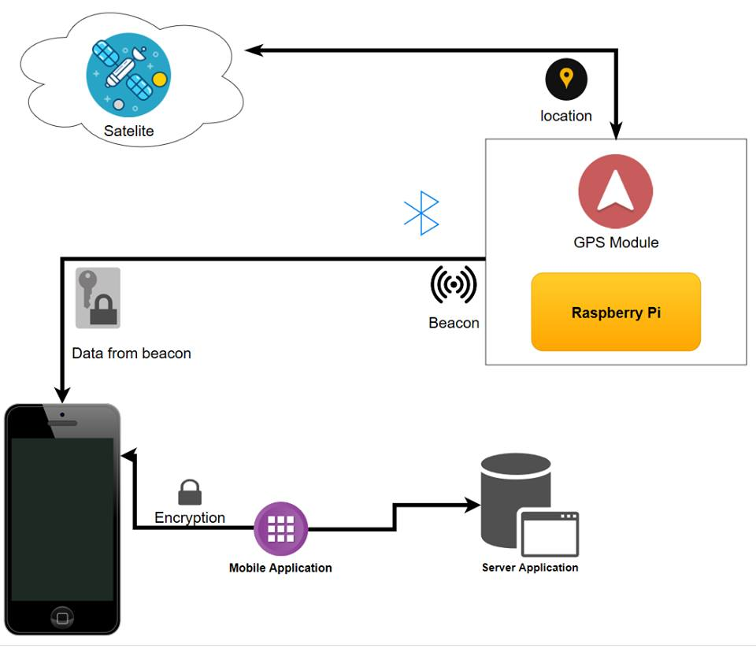
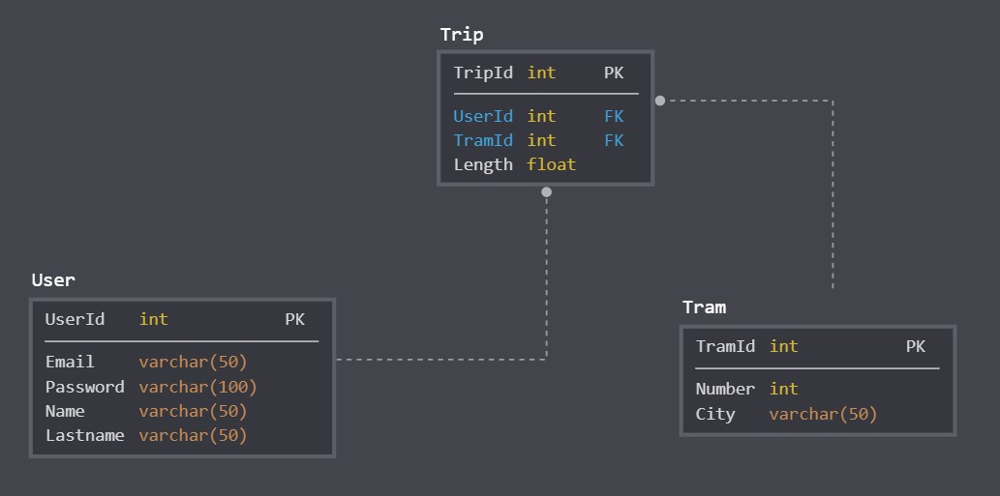
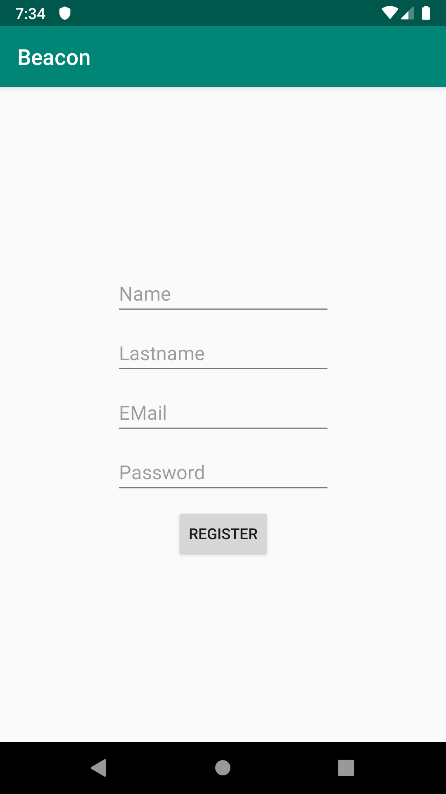
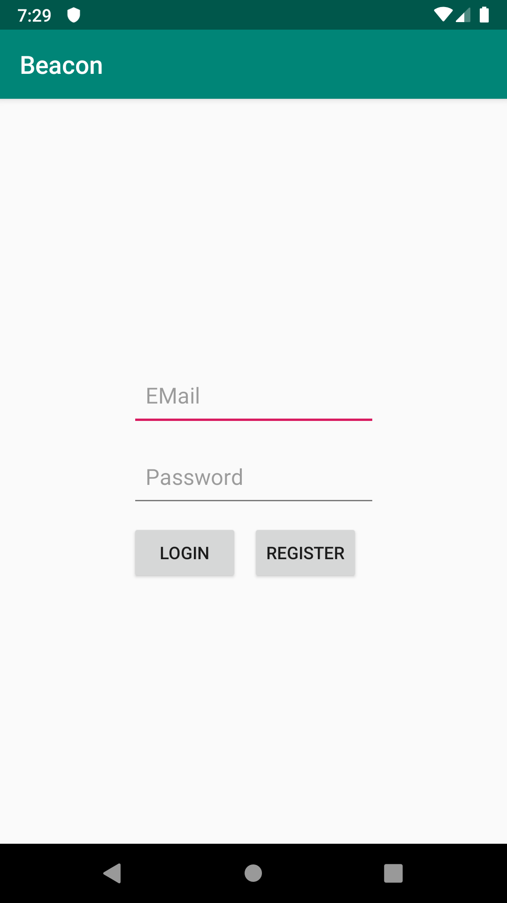
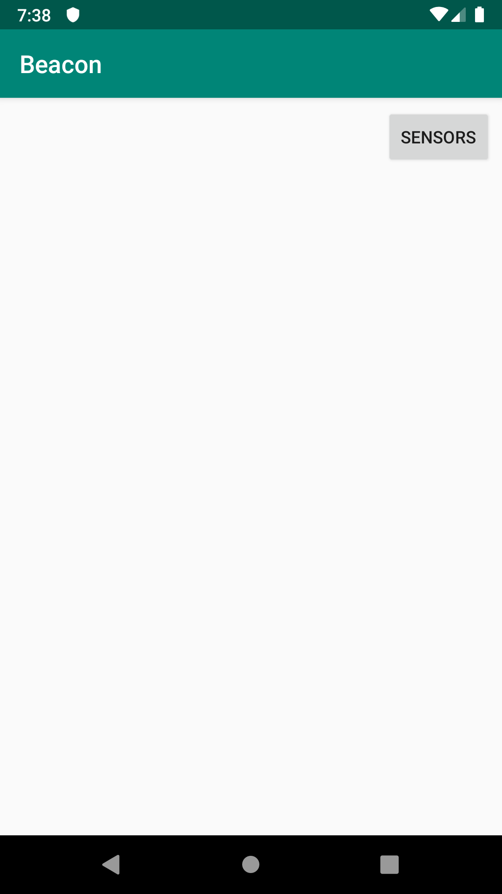
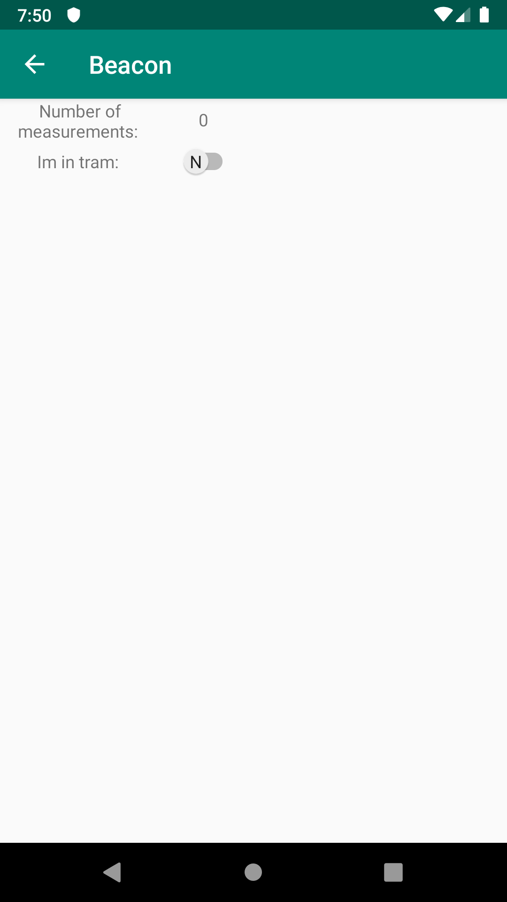

# Inteligentny tramwaj
## Spis treści
1. [Opis projektu](#1)
2. [Skład zespołu](#2)
3. [Baza danych i serwer aplikacyjny](#3)
4. [Aplikacja mobilna](#4)
5. [Sieć neuronowa](#5)
6. [Technologia beacon](#6)
## 1. Opis projektu<a name="1"></a>
Celem projektu ***Inteligentny tramwaj*** jest stworzenie systemu informatycznego, który umożliwi naliczanie opłat za korzystanie z usług transportowych w sposób jak najbardziej intuicyjny i korzystny dla użytkowników komunikacji miejskiej.<br/>
System będzie składał się z urządzeń beacon znajdującyh się w pojazdach komunikacji miejskiej, aplikacji moblinej dla użytkowników końcowych oraz serwera aplikacyjnego. Ogólny diagram działania systemu znajduje się poniżej. Poszczególne komponenty zostały opisane w stosownych rozdziałach.
<br/>

|</img>|
|:--:| 
| *Diagram przedstawiający działanie systemu* |
```diff
+ Dodać diagram sekwencji (lub diagramy dla poszczegónych elementów systemu??)
```
#### Funkcjonalności: ####
- Nadawanie danych dotyczących pojazdu i jego stanu przez urządzenie beacon
- Odbiór danych przez aplikację mobilną w telefonie
- Pozyskiwanie dodatkowych danych telemetrycznych z sensorów w telefonie
- Komunikacja aplikacji mobilnej z serwerem
- Określanie stanu użytkownika przez sieć neuronową, na podstawie dostarczonych danych i naliczanie opłat
- Obsługa kont użytkoników (rejestracja, autoryzacja, wybór sposobu płatności)
- Weryfikacja uprawnień przejazdowych przez kontrolera biletów
- Wysyłanie powiadomień wypychanych o rozpoczęciu i zakończeniu podróży (w zależności od preferencji użytkownika)
- Naliczanie opłat w przypadku utraty połączenia z telefonem
## 2. Skład zespołu<a name="2"></a>
### Prowadzący: *mgr inż. Bartosz Wieczorek* 
```diff
- Zweryfikować podział zadań
```
### Baza danych i serwer aplikacyjny:
- Yaroslav Goretskyi
- Krzysztof Wierzbicki
- Przemysław Fortuna
- Jakub Przybylski
- Paweł Młynarczyk
- Dariusz Syncerek
- Konrad Kowalczyk
### Aplikacja mobilna:
- Paweł Ciupka
- Adam Lindner
- Michał Szwarocki
### Sieć neuronowa:
- Krzysztof Pilcicki
### Technologia beacon:
- Przemysław Brzoska
- Dorian Grabarczyk
### Dokumentacja:
- Jan Kisielewicz
- Mateusz Wadlewski<br/><br/><br/>
## 3. Baza danych i serwer aplikacyjny<a name="3"></a>
Aplikacja korzysta z bazy danych *Microsoft SQL* znajdującej się w chmurze *Microsoft Azure*. Strukturę bazy prezentuje poniższy diagram.
```diff
- W związku ze zmianą bazy zmienić opis i diagram encji
```
<br/>

||
|:--:| 
| *Diagram ERD przedstawiający strukturę bazy danych* |

Link do repozytorium: [https://github.com/PrzemekFortuna/iTram](https://github.com/PrzemekFortuna/iTram)<br/>
Do komunikacji z aplikacją mobilną i przetwarzania pozyskanych danych utworzono serwer aplikacyjny w technologii *ASP.NET Core*.
API serwera znajduje się pod adresem: [http://itram.azurewebsites.net](http://itram.azurewebsites.net)<br/>
``` diff
+ Dodać diagram klas UML
```

#### Dostępne endpointy:
Endpointy opisane są na stronie: [http://itram.azurewebsites.net](http://itram.azurewebsites.net)
``` diff
+ Opisać brakujące endpointy w swaggerze
```
## 4. Aplikacja mobilna<a name="4"></a>
Link do repozytorium: <a href="https://github.com/PostAdam/TramBeaconApp">https://github.com/PostAdam/TramBeaconApp</a> <br/>
Aplikacja mobilna ma na celu dostarczenie użytkownikowi interfejsu graficznego, za pomocą którego, możliwe będzie korzystanie z funkcji udostępnianych przez aplikację. <br/>
Aplikacja została napisana w języku programowania *Java* z wykorzystaniem *Gradle*. <br/> <br/>
Aplikacja wykorzystuje następujące dane telemetryczne:
- nazwa użytkownika
- aktualna data
- ID najbliższego beacona
- przyśpieszenie XYZ + jednostka
- żyroskop XYZ + jednostka
- długość i szerokość geograficzna
- poziom naładowania baterii
- liczba kroków
- siła grawitacji XYZ + jednostka
- poziom oświetlenia otoczenia
- ciśnienie
- otaczające pole geomagnetyczne XYZ
- bliskość obiektu względem ekranu widoku urządzenia (CM)
- flagę czy jest się w tramwaju

#### Instrukcja użytkownika
| *Ekran* | *Nazwa ekranu* | *Opis* |
|:--:|:--:|:--:| 
|</img>| *1. Ekran rejestracji* | *W przypadku, jeśli użytkownik korzysta z aplikacji pierwszy raz, niezbędne jest by dokonał rejestracji.* |
|</img>| *2. Ekran logowania* | *Użytkownik, który posiada swoje konto, może zalogować się do aplikacji, by móc korzystać z reszty funkcjonalności* |
|</img>| *3. Ekran z listą dostępnych beaconów* | *Ekran pokazuję wszystkie dostępne beacony w najbliższym otoczeniu.* |
|</img>| *4. Ekran z informacjami o beaconie* | *Wybierając beacon z listy, użytkownik może sprawdzić bardziej dokładne informacje o nim.* |
|</img>| *5. Ekran pobierania danych telemetrycznych* | *Wybierając przycisk "SENSORS" na ekranie 3. użytkownik zaczyna pobierać dane telemetryczne, które z pewną częstotliwością zostają wysyłane na serwer.* |

``` diff
+ Zmodyfikować screen 3. (żeby były pokazane jakieś beacony)
+ Zmodyfikować screen 4. z informacjami o jednym beaconie
+
+ Dodać diagram klas UML
+ Sprawdzić poprawność danych telemetrycznych
```

## 5. Sieć neuronowa<a name="5"></a>
Link do repozytorium: <a href="https://github.com/kpilcicki/problem-workshop-net-poc">https://github.com/kpilcicki/problem-workshop-net-poc</a> <br/>
Sieć neuronowa ma na celu, na podstawie otrzymanych od aplikacji mobilnej danych, określić czy dana osoba znjaduje się wewnątrz pojazdu komunikacji miejskiej. Docelowo aplikacja zostanie zintegrowana z serwerem.<br/>
Sieć została przygotowana w języku programowania *Python* z wykorzystaniem frameworku *TensorFlow*.
``` diff
+ Dodać diagram klas UML po przeniesieniu na docelowy serwer
+ Dodać wyniki testów (w przyszłości jak już będą)
```

## 6. Technologia beacon<a name="6"></a>
W obecnej wersji systemu w zastępstwie beacona wykorzystujemy *Rasberry Pi*, które pobiera informacje nt. lokalizacji za pomocą modułu *GPS*. Następnie nadaje, korzystając z *Bluetooth*, sygnał składający się z *id* urządzenia oraz współrzędnych zapisanych w postaci `xxx.xxxxxx`, gdzie `x ∈ {0...9}`. Liczba dopełniana jest "`0`" z prawej strony oraz "`3`" z lewej strony.

``` diff
+ Dodać diagram prezentujący informacje o zabezpieczeniach
+ Dodać informację o wykorzystanym modelu RasberryPi i sensorach, dodać informację o oprogramowaniu.
```
## Miejsce na uwagi:
